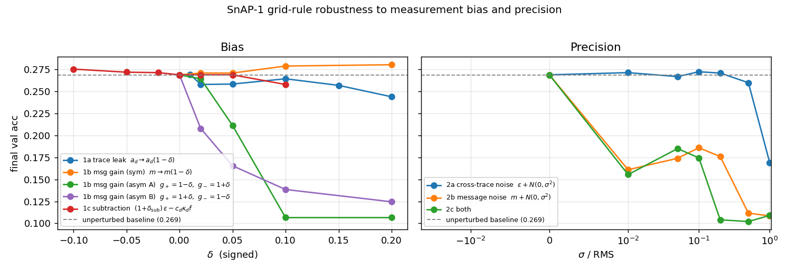
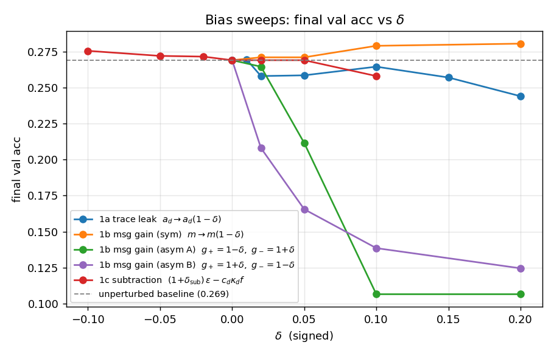
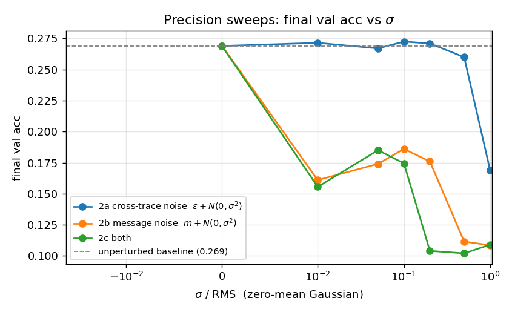

# Measurement-robustness sweep for SnAP-1 grid rule

Config: 6000 train images, 5 epochs, batch 32, Adam $\eta=3\times 10^{-3}$, single seed (init=0).

Unperturbed baseline final val acc: **0.269** (chance = 0.10).

## Headline plot

## Bias sweeps

Final val accuracy per condition:

| sweep | $\delta$ / $\sigma$ | val acc | drop |
|---|---|---|---|
| 1a_leak | +0.000 | 0.269 | +0.000 |
| 1a_leak | +0.010 | 0.269 | -0.000 |
| 1a_leak | +0.020 | 0.258 | +0.011 |
| 1a_leak | +0.050 | 0.258 | +0.010 |
| 1a_leak | +0.100 | 0.264 | +0.005 |
| 1a_leak | +0.150 | 0.257 | +0.012 |
| 1a_leak | +0.200 | 0.244 | +0.025 |
| 1b_gain_sym | +0.000 | 0.269 | +0.000 |
| 1b_gain_sym | +0.020 | 0.271 | -0.002 |
| 1b_gain_sym | +0.050 | 0.271 | -0.002 |
| 1b_gain_sym | +0.100 | 0.279 | -0.010 |
| 1b_gain_sym | +0.200 | 0.280 | -0.011 |
| 1b_gain_asym_A | +0.000 | 0.269 | +0.000 |
| 1b_gain_asym_A | +0.020 | 0.264 | +0.005 |
| 1b_gain_asym_A | +0.050 | 0.211 | +0.058 |
| 1b_gain_asym_A | +0.100 | 0.106 | +0.163 |
| 1b_gain_asym_A | +0.200 | 0.106 | +0.163 |
| 1b_gain_asym_B | +0.000 | 0.269 | +0.000 |
| 1b_gain_asym_B | +0.020 | 0.208 | +0.061 |
| 1b_gain_asym_B | +0.050 | 0.165 | +0.103 |
| 1b_gain_asym_B | +0.100 | 0.138 | +0.131 |
| 1b_gain_asym_B | +0.200 | 0.124 | +0.145 |
| 1c_subtraction | -0.100 | 0.275 | -0.006 |
| 1c_subtraction | -0.050 | 0.272 | -0.003 |
| 1c_subtraction | -0.020 | 0.271 | -0.002 |
| 1c_subtraction | +0.000 | 0.269 | +0.000 |
| 1c_subtraction | +0.020 | 0.269 | +0.000 |
| 1c_subtraction | +0.050 | 0.269 | +0.000 |
| 1c_subtraction | +0.100 | 0.258 | +0.011 |

## Precision sweeps

Final val accuracy per condition:

| sweep | $\delta$ / $\sigma$ | val acc | drop |
|---|---|---|---|
| 2a_eps_noise | +0.000 | 0.269 | +0.000 |
| 2a_eps_noise | +0.010 | 0.271 | -0.002 |
| 2a_eps_noise | +0.050 | 0.267 | +0.002 |
| 2a_eps_noise | +0.100 | 0.272 | -0.003 |
| 2a_eps_noise | +0.200 | 0.271 | -0.002 |
| 2a_eps_noise | +0.500 | 0.260 | +0.009 |
| 2a_eps_noise | +1.000 | 0.169 | +0.100 |
| 2b_msg_noise | +0.000 | 0.269 | +0.000 |
| 2b_msg_noise | +0.010 | 0.161 | +0.108 |
| 2b_msg_noise | +0.050 | 0.174 | +0.095 |
| 2b_msg_noise | +0.100 | 0.186 | +0.083 |
| 2b_msg_noise | +0.200 | 0.176 | +0.093 |
| 2b_msg_noise | +0.500 | 0.111 | +0.158 |
| 2b_msg_noise | +1.000 | 0.108 | +0.161 |
| 2c_combined_noise | +0.000 | 0.269 | +0.000 |
| 2c_combined_noise | +0.010 | 0.155 | +0.114 |
| 2c_combined_noise | +0.050 | 0.185 | +0.084 |
| 2c_combined_noise | +0.100 | 0.174 | +0.094 |
| 2c_combined_noise | +0.200 | 0.104 | +0.165 |
| 2c_combined_noise | +0.500 | 0.102 | +0.167 |
| 2c_combined_noise | +1.000 | 0.109 | +0.160 |

## Discussion

Key numbers (drop $\ge$ 0.05 below the unperturbed baseline):

- **1a_leak** — no break above threshold; tolerated up to |$\delta$| = 0.2 with drop < 0.05.
- **1b_gain_sym** — no break above threshold; tolerated up to |$\delta$| = 0.2 with drop < 0.05.
- **1b_gain_asym_A** — first break at $\delta$ = +0.05, drop = 0.058.
- **1b_gain_asym_B** — first break at $\delta$ = +0.02, drop = 0.061.
- **1c_subtraction** — $+\delta$ tolerated to max swept (drop < 0.05); $-\delta$ tolerated to max swept (drop < 0.05).
- **2a_eps_noise** — first break at $\sigma/\rm RMS$ = +1, drop = 0.100.
- **2b_msg_noise** — first break at $\sigma/\rm RMS$ = +0.01, drop = 0.108.
- **2c_combined_noise** — first break at $\sigma/\rm RMS$ = +0.01, drop = 0.114.

At this scale (6k train, 5 epochs, single seed; resolution roughly 0.02 val acc), additive precision noise degrades the rule more than the tested bias perturbations do --- which contradicts the prior expectation set in the experiment plan. The worst precision condition is **2c_combined_noise** at $\sigma/\text{RMS}=0.5$ (drop 0.167 below the 0.269 baseline). The worst bias condition is **1b_gain_asym_A** at $\delta$ = +0.1 (drop 0.163).

Within the bias category, **1c (subtraction)** is **not** the most fragile variant in this run: it tops out at a 0.011 drop, while 1b_gain_asym_A reaches 0.163. This contradicts the prior expectation that the past-only subtraction would be the dominant sensitivity; at this scale, the data suggests gain / leak biases damage learning at least as much as a subtraction-cancellation mismatch.

**Co-design implication.** The sweeps in { 1a_leak, 1b_gain_asym_A, 1b_gain_asym_B, 2a_eps_noise, 2b_msg_noise, 2c_combined_noise } exhibit a clear-of-noise effect, while the remainder are tolerated at the few-percent level. For silicon design this argues for spending tolerance budget on the failure modes that produced visible drops above and accepting looser specs on the rest. A full-scale rerun (60k train, $\ge 3$ seeds) would give tighter tolerance numbers for the affected knobs.
